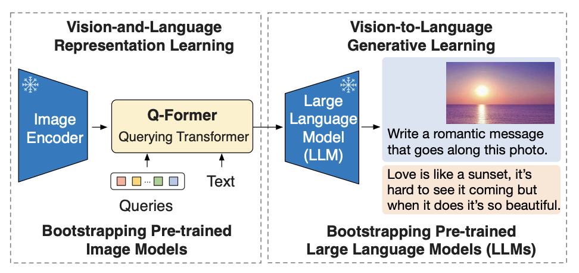
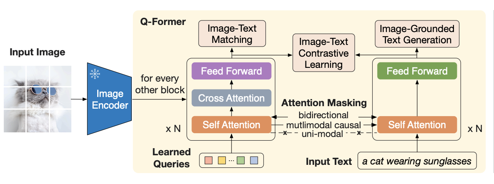
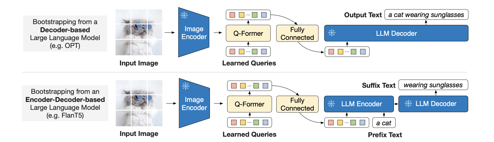

# Text-to-Image

Image-to-text, as the name suggests, is getting a text output given an image input. There are several different tasks that utilize this such as Visual Question Answering (VQA), image captioning or even Optical Character Recognition (OCR). 

## Table of Contents

- [Text-to-Image](#text-to-image)
  - [Table of Contents](#table-of-contents)
  - [1. VisualBERT](#1-visualbert)
  - [2. Vision Transformer](#2-vision-transformer)
  - [3. Vision Encoder Decoder Model](#3-vision-encoder-decoder-model)
  - [4. CLIP](#4-clip)
  - [5. BLIP](#5-blip)
  - [6. BLIP 2](#6-blip-2)
  - [7. Getting Started](#7-getting-started)
  - [8. Resources](#8-resources)

## 1. [VisualBERT](https://arxiv.org/pdf/1908.03557.pdf)

Source: [VisualBERT paper](https://arxiv.org/pdf/1908.03557.pdf)

VisualBERT is largely based on the original [BERT](https://jalammar.github.io/illustrated-bert/) architecture. This is further modified to include a set of visual embeddings. A CNN acts as an object detector and identifies entities in the image. The corresponding embedding is then obtained from a pre-trained CNN such as a ResNet and then sent into the BERT model.

More specifically, each input embedding is the sum of three separate embeddings - the position, segment, and token embedding. The token embedding is the respective text or image embedding for that particular token (where a detected object in the image is considered a token). The segment embedding indicates if the embedding is textual or visual. The position embedding is the standard positional embedding for text. For images, it is the sum of the positional embeddings of text that is aligned with the image region (if provided). The rest of the training loop proceeds as usual.

The model is usually trained on image+caption data such as [COCO](https://cocodataset.org/). First, the model is pre-trained in a task-agnostic manner. This is followed by task-specific pre-training and finally task-specific fine-tuning.

You can get the VisualBERT model as well as several fine-tuned checkpoints for specific tasks through [HuggingFace](https://huggingface.co/docs/transformers/model_doc/visual_bert).

[[Back to top]](#)

## 2. [Vision Transformer](https://arxiv.org/abs/2010.11929)

Source: [Vision Transformer paper](https://arxiv.org/abs/2010.11929)

The Vision Transformer (ViT) is similar to VisualBERT in that it uses a transformer-based architecture for image data. More specifically, it uses a transformer encoder. The image is split into fixed-size patches which are then flattened by passing them through a linear layer. Position embeddings are added to each patch projection and the sequence is fed as an input to a standard transformer encoder. Inspired by BERT, a learnable `[class]` embedding is prepended to the sequence which is then fed into a classification head. This model is pre-trained in a supervised fashion with image labels and then fine-tuned on an image classification dataset. 

At a high level, we can think of the ViT model as on that applies a transformer to image classification. Since breaking the entire image down into pixels and using attention with a large sequence length (a 64x64 image would need an attention matrix of 4096x4096) would not be feasible, the image is broken down into smaller patches. Thus the attention matrix is smaller and the model is faster (presumably at the cost of some performance). 

In terms of performance, the ViT outperforms CNNs only if there is a lot of data (~10 million). Otherwise the CNN generally wins out. ViT also has a comparitively lower training time. While the vision transformer isn't used on its own often, it is important to understand since many future models build on it. 

There are several spin-offs of the ViT model such as BEiT (BERT Pre-Training of Image Transformers) which essentially performs self-supervised pre-training instead of supervised pre-training.

[[Back to top]](#)

## 3. [Vision Encoder Decoder Model](https://huggingface.co/docs/transformers/main/model_doc/vision-encoder-decoder)

The Vision Encoder Decoder Model is a generic framework to create an image-to-text model using any pretrained transformer-based vision model as an encoder and any pretrained language model as the decoder. It is based on Microsoft's [TrOCR](https://arxiv.org/abs/2109.10282) model. Transformer based vision models include ViT and BEiT while the decoder can be something like GPT or BERT. 

This model is interesting because it builds on two different models - one to process image data and the other to process text data. It then simply combines the functionalities of these two models to perform a particular task. For instance, the [vit-gpt2-image-captioning](https://huggingface.co/nlpconnect/vit-gpt2-image-captioning) model uses a ViT encoder and GPT-2 decoder and is trained for image captioning. While not particularly a state of the art model anymore, it does give a good idea of how we can build new models from existing ones.

While this may initially sound confusing, this is actually the same as any other transformer model. At a high level, we take in an input and encode it. Our decoder takes some starting token and attempts to use the embeddings from the encoder through cross attention in order to generate some content. The only real difference here is that instead of using a text-based encoder, we use a vision-based encoder. We still pass the generated embedding to the decoder in the same way (cross attention). The decoder functions as normal with no special changes.

[[Back to top]](#)

## 4. [CLIP](https://arxiv.org/abs/2103.00020)

CLIP (Contrastive Language-Image Pre-training) contains both an image and text encoder. It takes as input an image and a caption, encodes them and compares the embeddings using a (cosine) similarity metric. The model is then trained on this similarity task (=1 when the image and caption are related and =0 otherwise). After training for a long while, our encoder reaches a point where the image embedding for a picture of a dog and the text embedding for "a picture of a dog" are very similar. To better train the model, negative samples are also used (sample an image and unrelated caption or vice-versa). We can then give it a phrase and acquire an embedding in the image space that corresponds to that phrase (or vice-versa). This process is known as contrastive learning. The encoders may vary based on the specific model but in general the text encoder is some kind of transformer model and the image encoder is usually a ResNet or a Vision Transformer.

[[Back to top]](#)

## 5. [BLIP](https://arxiv.org/abs/2201.12086)

Source: [BLIP paper](https://arxiv.org/abs/2201.12086)

BLIP (Bootstrapping Language-Image Pre-training) was created by Salesforce as a general purpose vision-language model for both understanding and generation tasks including captioning, question-answering and reasoning. BLIP is a multimodal mixture of encoders and decoders that integrates three functionalities:

1. Unimodal Encoder: This attempts to encode the text and visual data separately through BERT and a Vision Transformer respectively. These two models are trained through Image-Text Contrastive (ITC) loss which aims to align the feature space of the two models. This is done by pushing similar image-text pairs to have similar representations. 

2. Image-Grounded Text Encoder: This inserts a cross-attention layer between the self-attention and feed forward layers of each transformer block in the text encoder. A task-specific [Encode] token is appended to the text, and the output embedding of [Encode] is used as the multimodal representation of the image-text pair. This block uses Image-Text Matching (ITM) loss to distinguish between positive and negative image-text pairs. ITM is a binary classification problem where the model just predicts if an image-text pair is matched or unmatched.

3. Image-Grounded Text Decoder: This replaces the bi-directional self-attention layers in the previous block with causal self-attention layers. A special [Decode] token is used to signal the beginning of a sequence. A standard Language Modeling (LM) loss is used here to generate text conditioned on an image. 

Note that the architecture above is color-coded to denote shared parameters. For instance, between the image-grounded text encoder and decoder, the parameters of the feedforward and cross attention layers are shared. The authors claim that this is because the differences between the encoding and decoding tasks are best captured by the self-attention layers. Thus the encoder uses bi-directional self-attention to build representations for the current input while the decoder uses causal self-attention to predict the next tokens. 

All three objectives (ITC, ITM, LM) are optimized during the pre-training process. Thus each image-text pair requires one forward pass of the vision transformer and three forward passes through the text transformer. 

[This](https://blog.salesforceairesearch.com/blip-bootstrapping-language-image-pretraining/) blog from the Salesforce teams takes a deeper dive into this model. The BLIP model is a fairly robust model that works well for most vision-language tasks and thus is a good starting point for any work in this area. The model can be used through [HuggingFace](https://huggingface.co/Salesforce/blip-image-captioning-large).

[[Back to top]](#)

## 6. [BLIP 2](https://arxiv.org/abs/2301.12597)

Source: [BLIP 2 paper](https://arxiv.org/abs/2301.12597)

While one might think that BLIP-2 is just a more advanced version of BLIP's architecture, they actually are quite different. BLIP-2 uses three different components - an image encoder, a Large Language Model and a Querying Transformer (Q-Former). The image encoder and LLM are frozen off-the-shelf models. Specifically, the authors tested ViT-L/14 from CLIP and ViT-g/14 from EVA-CLIP for the image transformer, and a decoder-based LLM (OPT family) as well as an encoder-decoder LLM (Flan-T5 family) for the choice of LLM. These models can presumably be replaced with any other model in the same category. The Q-Former is the only trainable part of BLIP-2 which aims to address the vision-language alignment problem between the embedding space of the frozen image encoder and the frozen LLM. 

The Q-Former consists of two transformer submodules that share the same self-attention layers (architecture below). The first is an image transformer that interacts with the frozen image encoder to extract visual features while the second is a text transformer that functions as both a text encoder and decoder. In addition, a set number of learnable query embeddings are created to act as an input to the image transformer. The Q-Former does not directly interact with the image encoder. Instead, the extracted features are inserted in the cross-attention layers of every other transformer block. The queries interact with each other (and to text data) through self-attention and interact with the image features through the cross-attention layers. The idea is that these query embeddings learn to extract the features of the image that is most relevant to the text. The Q-Former is initialized with a pretrained BERT model's weights (with the cross attention layers being randomly initialized). Training proceeds in a two-phase fashion.

Source: [BLIP 2 paper](https://arxiv.org/abs/2301.12597)

In the first phase, the image encoder and the Q-Former are trained using image-text pairs. Inspired by BLIP, they use three loss functions - ITC and ITM which were used by BLIP, as well as an Image-grounded Text Generation (ITG) loss function. In ITG, the goal is to generate text (using a causal attention mask) conditioned on an image. This helps to train the query embeddings to extract the most relevant features. 

Source: [BLIP 2 paper](https://arxiv.org/abs/2301.12597)

In the second phase, the frozen image encoder + Q-Former combo is connected to the frozen LLM. A fully connected layer projects the output query embeddings from the Q-Former into the dimension required by the LLM. These are then prepended to the input of the model. The authors state that these embeddings act as soft visual prompts that condition the LLM on visual representations extracted by the Q-Former. The exact process is slightly different depending on the LLM (decoder only vs encoder-decoder) as seen in the image above. In both cases, some form of the Language Modeling (LM) loss is used.

There are several pre-trained and fine-tuned versions of BLIP 2 available, all of which can be found on [HuggingFace](https://huggingface.co/models?search=salesforce/blip2-).

[[Back to top]](#)

## 7. Getting Started

We have two example notebooks for you to get started with! The first is `im2text_finetuning.ipynb` which walks you through the process of fine-tuning an image-to-text model (BLIP). The second is `im2text_applications.ipynb` which is a quick demo for you to see how image captioning and VQA works.

[[Back to top]](#)

## 8. Resources

* [A Dive into Vision-Language Models](https://huggingface.co/blog/vision_language_pretraining): An informative blog from HuggingFace.

* [BLIP: Bootstrapping Language-Image Pre-training for Unified Vision-Language Understanding and Generation](https://blog.salesforceairesearch.com/blip-bootstrapping-language-image-pretraining/): A summary of the BLIP model from the Salesforce team.

* [Interactive demo: comparing image captioning models](https://huggingface.co/spaces/nielsr/comparing-captioning-models): A useful tool to compare the results of GIT, BLIP, BLIP-2 and InstructBLIP on the same image.

[[Back to top]](#)
