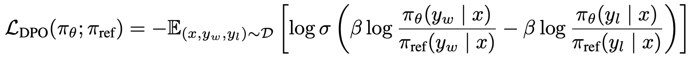

# Alignment

Large language models (LLMs) are often trained on large amounts of data that generally includes information from the internet. This training process means that LLMs may exhibit behaviors that they see in the data. Unfortunately, the internet as a whole is not the greatest example of "good" behavior. Thus, having a method to guide the LLM to generate outputs in a [helpful, honest and harmless manner](https://arxiv.org/abs/2204.05862) can be important. Alignment is this process of "aligning" the LLM to human standards. In general, human standards refers to a combination of helpfulness (assist users), honesty (do not make up things/use only truthful information) and harmlessness (do not be offensive or discriminatory). This is called the [HHH Framework](https://www-files.anthropic.com/production/images/Model-Card-Claude-2.pdf).

Alignment can be a challenging task. Even if we were to find a dataset of human behavior and fine tune a model on it, there's no guarantee that the model can achieve our criteria. For instance, let’s say we have two responses to a given prompt. Both might be technically true but one uses discriminatory language while the other doesn't. How can we tell the model that the non-discriminatory version is preferred over the discriminatory version? In other words, how can we use human preferences or feedback to train a model?

We cover a number of methods that explore solutions to this problem. In all cases, a pre-trained LLM is used as a base upon which alignment techniques are used.

# Reinforcement Learning from Human Feedback (RLHF)

RLHF is a method of fine-tuning LLMs that has grown into recent popularity with several Large Language Models (LLMs) including OpenAI's ChatGPT, Anthropic's Claude and DeepMind's Sparrow utilizing some variation of it. It consists of three steps that combine supervised training and reinforcement learning. 

RLHF Overview from OpenAI's [ChatGPT blogpost.](https://openai.com/blog/chatgpt)

## Step 1: Supervised Fine Tuning (SFT)

This step involves fine-tuning the LLM on data for some particular task. This is usually dialogue-focused data to better suit conversational AI. This step involves anywhere from 10k-100k (prompt, response) pairs.

## Step 2: Training a Reward Model (RM)

This step involves training a separate model to rank preferences. Specifically, given a prompt and two outputs, the model outputs a scalar score for each output. 

In order to train this model, human feedback is required. Thus, a large number of prompts are fed in to the model to acquire a number of outputs for each prompt. In some cases, the outputs could be edited or even written by humans. In any case, human labelers rank all the outputs for each prompt. This dataset of prompts alongside a number of ranked outputs is called a comparison dataset. While the specific number of prompts may vary, the number of training data points (prompt, winning_response, losing_response) is usually in the order of 100k to a few million. For instance, [InstructGPT (section A.3)](https://arxiv.org/abs/2203.02155) uses around 50k prompts, each of which have 4-9 responses. 

During the training process, we select a prompt and sample two associated outputs from our dataset. The higher ranked output is given a label of 1 while the other gets a label of 0 (though in some cases, soft labels may be used). The reward model is then trained using a pairwise loss function as defined below: 

$loss(r_\theta) = -log (\sigma(r_\theta(x, y_i) - r_\theta(x, y_j))$

where $r_\theta$ is the model, $x$ is the prompt and $y_i, y_j$ are the higher and lower ranked outputs respectively. 

## Step 3: Reinforcement Learning Fine-Tuning

The third step utilizes reinforcement learning to train the model from step 1 (sometimes called the policy or actor model) via a reinforcement learning algorithm called Proximal Policy Optimization (PPO). We do not go into the details of this algorithm as it involves significant knowledge of reinforcement learning. 

At a high level, we sample a random prompt and feed it to the policy model (the LLM). This model then generates an output based on the prompt. This output is appended to the initial prompt and is then sent to the reward model, which outputs a preference score. The PPO algorithm then uses this score to update the policy model. This is repeated for a large number of prompts. 

This step requires about 10k-100k prompts. [InstructGPT](https://arxiv.org/abs/2203.02155) uses about 40,000. 

## LLaMa 2 RLHF

LLaMa 2 introduced some [changes](https://arxiv.org/abs/2307.09288) to the RLHF paradigm. Specifically, the authors used multiple reward models each offering a reward for different criteria - namely safety and helpfulness. The final reward function is simply a linear combination of these reward models. 

In addition, the data is annotated differently than OpenAI's approach. Instead of ranking responses and then picking two of them at each training step, only two responses are annotated for each prompt. However, there is also an extra "margin" label that ranges from "significantly better" to "negligibly better". This margin label can then be used during the training step as a "margin loss". 

Finally, LLaMa 2 uses something known as rejection sampling. In rejection sampling, K outputs are sampled from the model and the output with the highest reward (from the reward model) is chosen. In step 3 of RLHF, they train 5 successive versions (with a new batch of preference data used for each model) of the RLHF model. The first 4 exclusively use rejection sampling and in the final model, they use a combination of rejection sampling and PPO. The authors state that rejection sampling acts as a breadth search due to multiple sampling while PPO acts as depth search. 

# Reinforcement Learning from AI Feedback (RLAIF)

RLAIF is similar to RLHF except that it replaces human feedback with AI feedback. Here AI feedback refers to a model, usually some kind of LLM, providing the feedback. The input to this feedback-providing LLM is structured such that there's a preamble detailing the task and instructions, few-shot (solved examples of similar tasks) examples, a sample to annotate and an ending string to prompt the LLM ("Preferred Answer = ").

Sometimes, the preamble can be more detailed and act as a "constitution". The constitution acts as a set of principles defined in natural language for the LLM to follow while providing feedback. We can thus describe the qualities of desirable outputs to the LLM in order to make it more helpful and harmless. In scenarios where all the answers offered to the reward model contain undesirable properties, a dataset cleaning process can be undertaken. In this process, the LLM generates revisions of a given answer while the AI Feedback model determines if there are undesirable qualities to the generated revision. When undesirable properties are identified, the AI Feedback model provides feedback to the LLM on why the revision was rejected.

# [Direct Preference Optimization (DPO)](https://arxiv.org/abs/2305.18290)

Direct Preference Optimization (DPO) demonstrated that the RLHF objective can be rewritten as a function of the policy model (the LLM). That is, mathematically, DPO is equivalent to RLHF. Thus DPO can directly define the loss as a function of the policy model. This lets us bypass the reward model and reinforcement learning steps of RLHF and instead directly optimize the language model using preference data (feedback). 

We can think of it as a supervised learning problem where our dataset is of the form (prompt, winning_response, losing_response). Instead of predicting text, we instead compute the probability of the model outputting a particular response. We then substitute these values into the DPO loss function (which is based on binary cross-entropy):

where $\pi_\theta$ is the LLM being trained, $\pi_{ref}$ is the reference LLM, $x$ is the prompt, $y_w$ and $y_l$ are the winning and losing responses, and $\beta$ is a hyperparameter.

The reference LLM is a version of the LLM from before the DPO training began that has its parameters frozen. The goal is to ensure that the trained model outputs higher probabilities than the reference model for winning responses and lower probabilities than the response model for losing responses. Thus by taking the ratio of the trained LLM by the reference LLM, we obtain implicit rewards.

$\beta$ is a hyperparameter that controls the strength of the KL-Penalty. The authors used a value of 0.1 for most experiments.

Note: We still perform the SFT step from RLHF and we still need to collect a significant amount of human feedback. DPO only eliminates the reward modeling and reinforcement learning steps from RLHF.

# Other Alignment Methods

Alignment is a fairly recent topic. While this document covers some approaches, there may be others worth looking into. For instance, [Rank Response to align Human Feedback (RRHF)](https://github.com/GanjinZero/RRHF) claims comparable performance to RLHF-based models with simpler training paradigms.

One drawback with both RLHF and DPO is that they require significant amounts of preference data (output A is better than output B). [Kahneman-Tversky Optimization (KTO)](https://github.com/ContextualAI/HALOs/blob/main/assets/report.pdf) is an alignment method, based on theories from behavioral economics, that does not require preferences like those used by RLHF and DPO. Instead, it works with binary feedback - the output is either desirable or undesirable. 

# Frequently Asked Questions

* Manually having annotators rank outputs is both expensive and time-consuming. What are my alternatives?

  In some cases, we might already have the rankings we need. For example, the [Stack Exchange Preferences Dataset](https://huggingface.co/datasets/lvwerra/stack-exchange-paired) consists of pairs of answers to Stack Exchange questions. Since the platform already uses a voting system, these existing votes can be used as the ranking instead. Similarly, other websites such as reddit also have a voting system and thus could be used in place of human annotators. There are also existing open source datasets such as [Anthropic's hh-rlhf](https://huggingface.co/datasets/Anthropic/hh-rlhf).

* Some of these models have billions of parameters. How do they train these models efficiently?

  Most of the LLMs in the news are enormous and are usually too big to fit on a single GPU. As a solution to this, large models generally use a combination of distributed training strategies alongside other techniques. Some common strategies include [parallelism](https://huggingface.co/docs/transformers/v4.17.0/en/parallelism), [Low Rank Adaptation (LoRA)](https://huggingface.co/docs/diffusers/training/lora) and [8-bit matrix multiplication](https://huggingface.co/blog/hf-bitsandbytes-integration).

* How do we select human annotators such that they represent a diversity of regional, cultutral and other backgrounds? This is important to prevent unwanted biases from seeping into the model.

  Appendix B of the [InstructGPT paper](https://arxiv.org/abs/2203.02155) goes into detail on how OpenAI approached this problem.

* How do we validate the human preferences obtained for step 2? If we have 10 different outputs for a prompt, people are likely to rank them in different orders due to their own biases. Thus we can't use a single person's ranking. But how many people do we need for this? Do we use a majority ranking or an average? 

  [InstructGPT (section 5.3)](https://arxiv.org/abs/2203.02155) used around 40 labelers but there was rarely any overlap in the comparisons that they labeled. OpenAI acknowledges that this isn't ideal but does note that the labelers tended to agree with each other roughly 70% of the time. They also note that simply taking the average preference doesn't always work. For example when generating text that affects a minority group negatively, that group's preferences should be weighed more heavily.
  
* How big of a model do we need to get good results?

  From our experience, the specific model and dataset(s) used is more important in determining performance. Consult the [Chatbot Arena Leaderboard](https://lmsys.org/blog/2023-05-25-leaderboard/) for more insight into model performance. 

* What hyper-parameters make the most impact on the results?

  The folks in charge of DeepSpeed have an [entire document](https://github.com/microsoft/DeepSpeedExamples/blob/master/applications/DeepSpeed-Chat/training/README.md) detailing their study on this topic, although this is specific to RLHF.

# Resources

* [Dahoas/rm-static](https://huggingface.co/datasets/Dahoas/rm-static): An example of the kind of data that the reward model training requires.
* [https://github.com/heartexlabs/RLHF/blob/master/tutorials/RLHF_with_Custom_Datasets.ipynb](RLHF With Custom Datasets): A quick guide to using RLHF with a custom dataset.
* [https://huyenchip.com/2023/05/02/rlhf.html](RLHF: Reinforcement Learning from Human Feedback): Blog post from Chip Huyen.
* [wandb rlhf tutorial](https://wandb.ai/carperai/summarize_RLHF/reports/Implementing-RLHF-Learning-to-Summarize-with-trlX--VmlldzozMzAwODM2): A tutorial on training a summarization model via RLHF.
* [Microsoft DeepSpeed](https://github.com/microsoft/DeepSpeed/tree/master/blogs/deepspeed-chat): DeepSpeed is a deep learning optimization library. It also offers a relatively easy way to get started with RLHF.
* [Hugging Face's StackLLaMa](https://huggingface.co/blog/stackllama): An instructive blog post on training LLaMA with RLHF.
* [Rank Response to align Human Feedback (RRHF)](https://github.com/GanjinZero/RRHF): This is an alternative to RLHF that is in active development. They claim comparable performance to RLHF-based models with a simpler training paradigm.
* [RLAIF: Scaling Reinforcement Learning from Human Feedback with AI Feedback](https://arxiv.org/abs/2309.00267): Compares RLAIF vs RLHG empirically.
* [Constitutional AI: Harmlessness from AI Feedback](https://arxiv.org/abs/2212.08073): Introduces the idea of constitutional AI
* [LLM Training: RLHF and Its Alternatives](https://magazine.sebastianraschka.com/p/llm-training-rlhf-and-its-alternatives): A comprehensive blog post exploring RLHF in-depth.
* [Llama 2: Open Foundation and Fine-Tuned Chat Models](https://arxiv.org/abs/2307.09288): The LLaMa 2 paper.
* [Direct Preference Optimization: Your Language Model is Secretly a Reward Model](https://arxiv.org/abs/2305.18290): Another alternative to RLHF.