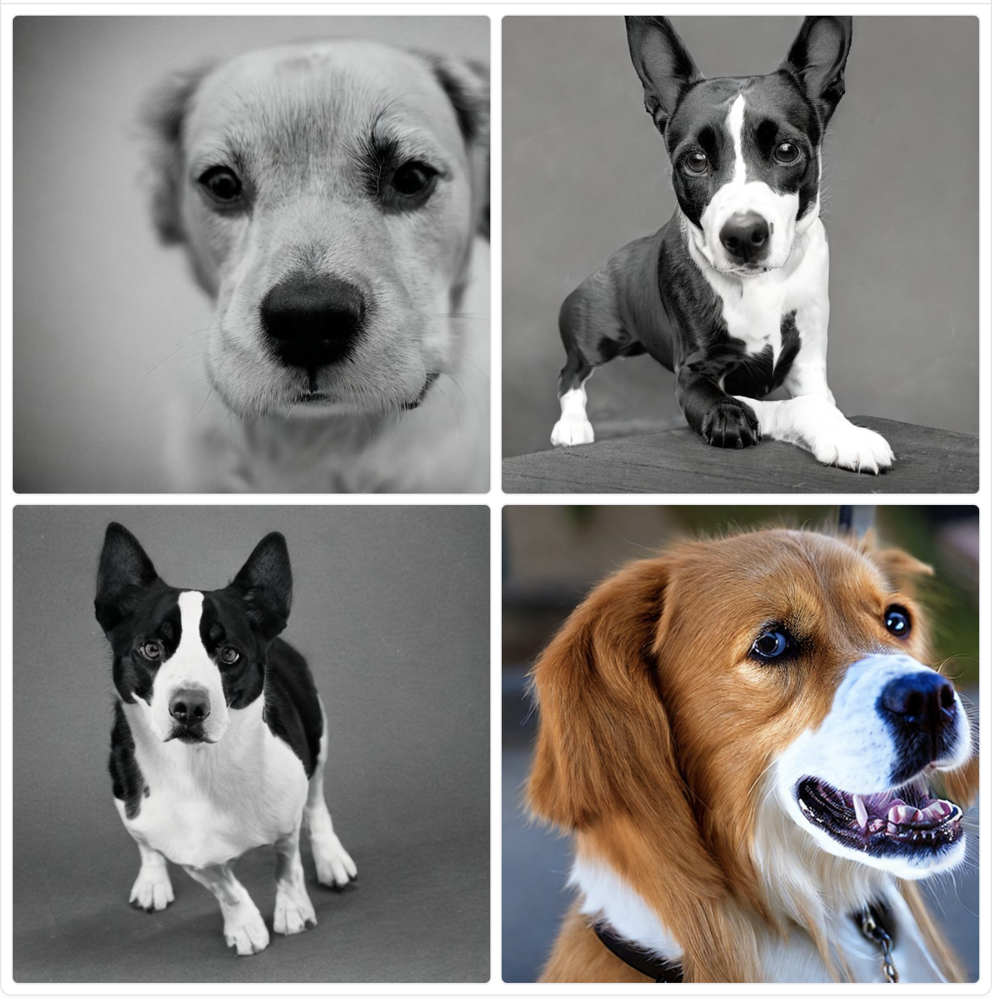
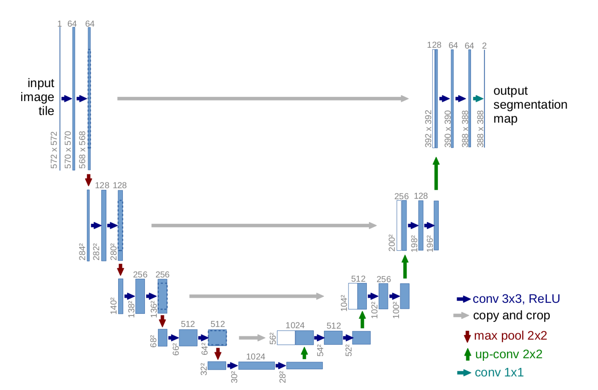

# Text-to-Image

Text-to-image, as the name suggests, is the use of models to convert text into images. So for instance, we could pass in an input such as "A picture of a dog." and the model would generate a picture of a dog. For instance:

Output from [StableDiffusion](https://huggingface.co/spaces/stabilityai/stable-diffusion) for the prompt "A picture of a dog."

Traditional approaches to text-to-image models in this field relied on Generative Adversarial Networks (GANs) and Variational Auto-Encoders (VAE). While these architectures aren't used in the latest models, they have heavily influenced them. In general though, all these different approaches tend to learn a distribution from which new images can be sampled from. Each model can in addition be unconditional (generate arbitrary images with no user input) or conditional (the user can provide information such as text to direct the generation).

In the next section, we first examine the U-Net, which is the model traditionally used during the diffusion process. We then take a look at the process of diffusion itself. Diffusion is what powers the three main models used today for the text-to-image tasks (Stable Diffusion, Midjourney, and DALL-E).

## Table of Contents

1. [U-Net](#1-u-net)
2. [Diffusion](#2-diffusion)

    2.1. [Adding Control (Context)](#21-adding-control-context)

    2.1.1. [Context Vector](#211-context-vector)

    2.1.2. [CLIP](#212-clip)
    
    2.2. [DDIM](#22-denoising-diffusion-implicit-models)

3. [Stable Diffusion](#3-stable-diffusion)

4. [Midjourney](#4-Midjourney)

5. [DALL-E](#5-DALL-E)

6. [Comparison](#6-comparison)

7. [Getting Started](#7-getting-started)

8. [Resources](#8-resources)

## 1. U-Net

Source: [UNet — Line by Line Explanation, Jeremy Zhang](https://towardsdatascience.com/unet-line-by-line-explanation-9b191c76baf5)

The U-Net is a made up of blocks of CNNs each working on the output of the previous block. The name comes from the "U" shape of its architecture. In the U-Net, the input and output images have the exact same shape. This gives us some advantages. For instance, it was originally developed to perform pixel-level classification. In our case however, we use it as a way to modify the image.

The first half of the U-Net (called the Contractive Path) consists of a number of downsampling convolutional blocks (usually with the help of MaxPooling). This continues till the bottom of the "U" shape, where there are only convolutional layers. We then enter the second half of the U-Net (the Expansive Path) where we use transposed convolutional blocks to upsize the images. There is an important bit here as you may have seen in the image above - we bring in information from the corresponding layer in the contractive path and concatenate it with these layers. These are used to pass information from the earlier stages. At the very end, we have a non-mirrored convolution (1x1 in the image) to get the image in the shape we want.

So why do all diffusion models use the U-Net? There's no definitive answer but there are a number of possible reasons! One advantage is that we can add in more information to the U-Net in the form of embeddings. For the diffusion process specifically, we can add in a time embedding (the level of noise) and a context embedding (text description). In addition, the use of skip-connections in the model architecture helps in the denoising process. Finally, the U-Net is just a very common architecture for images, so it could just be that.

[[Back to top]](#)

## 2. Diffusion

Simply put, diffusion models are in the business of generating image by consecutively removing noise from some arbitrary noise vector. So how does this work?

Broadly this happens over three steps: the forward diffusion phase which is used to generate data samples, the training phase which trains a model to predict noise, and the image generation phase where the consecutive noise removal happens. 

We do this by subtracting the noise from the image at each stage. We do this over a number of steps (a tunable parameter) to give the model more training data and also improve training stability. 

1. Forward Diffusion:
    * Pick an image from the dataset.
    * Sample a random timestep (sometimes called a noise level). A higher timestep means the amount of noise is greater. This timestep is a parameter that we can set.
    * Sample noise based on the noise level.
    * Add the noise to the image.

2. Train Noise Predictor:
    * Perform forward diffusion.
    * The model takes this as input and predicts the noise added to the image.
    * Note that we don't necessarily train on every image for every possible timestep. We sample random timesteps. 

3. Sample/Generate Images:
    * This sampling process is done via DDPM (Denoising Diffusion Probabilistic Models).
    * Sample random noise and a noise level to the model.
    * We get a predicted noise.
    * Now subtract the predicted noise from the sample.
    * Send the new image back to the model.
    * We get a predicted noise.
    * Now subtract the predicted noise from the sample.
    * And so on until we reach the total number of timesteps.
    * It is important that we use normally distributed noise for the denoising step to help stabilize the neural network. Otherwise it might just collapse into something that's just the average of the dataset. 
    * Hence, in the denoising step we remove the predicted noise from the image but also add some noise to make the overall image fall into the same normal distribution. This added noise amount is based on the current time step.

[[Back to top]](#)

### 2.1. Adding Control (Context)

We simply modify the U-Net so that it takes in token embeddings alongside the noise input and amount. This could be as simple as creating a context vector and just multiplying it with the result of the layers in the model. Or, as is the case with StableDiffusion, we could use something like attention layers between the CNN blocks of the U-Net.

While training, we also randomly mask some of the context to help the model better learn the general structure of images in the data.

During the image generation process, we can pass in custom context vectors to direct the model to generate something we want.

[[Back to top]](#)

### 2.1.1. Context Vector

The simplest way to add context is to just use a one hot encoded representation of the classes you have. However if you want to offer a lot more control, an embedding is the way to go. Traditionally a language model is used to acquire this embedding. The original diffusion paper used BERT while StableDiffusion uses CLIP. Research has shown that the quality of the LLM significantly affects the quality of the generated image. 

[[Back to top]](#)

### 2.1.2. [CLIP](https://arxiv.org/abs/2103.00020)

CLIP (Contrastive Language-Image Pre-training) contains both an image and text encoder. It takes as input an image and a caption, encodes them and compares the embeddings using a (cosine) similarity metric. The model is then trained on this similarity task (=1 when the image and caption are related and =0 otherwise). After training for a long while, our encoder reaches a point where the image embedding for a picture of a dog and the text embedding for "a picture of a dog" are very similar. To better train the model, negative samples are also used (sample an image and unrelated caption or vice-versa). We can then give it a phrase and acquire an embedding in the image space that corresponds to that phrase.

[[Back to top]](#)

### 2.2. Denoising Diffusion Implicit Models

One issue with DDPM is that the sampling process is slow since there are many timesteps and each timestep is dependent on the output of the previous timestep.

DDIM is faster because it skips a bunch of timesteps. Essentially this makes the model predict a rougher idea of what the final output would look like. The trade-off is of course that the results aren't as good as DDPM. 

Note: Regardless of how the model was trained, we can use either DDPM or DDIM since they are both just sampling methods.

[[Back to top]](#)

## 3. [Stable Diffusion](https://stability.ai/stablediffusion)

StableDiffusion is perhaps the most popular image generation model today for a simple reason - it's fully open source. You can create, deploy and productize your own version of the model! There's plenty of models online for you to play around with and several communities focused on it. It's normally pretty good at most types of art and can be specialized to a particular art style by just finetuning an existing model (or training your own!). 

Like many of these models, there are several different versions of Stable Diffusion. We focus on some of the main distinctions. First, Stable Diffusion doesn't work directly in the pixel space for the diffusion process. Instead, it works on a latent space via an autoencoder. This is helpful in speeding up the process. Instead of working on a gigantic 512x512 pixel space, we can compress that into a much smaller latent space and get very similar results.

This works exactly the same way as the diffusion process described above but with an additional step. For instance, in the forward diffusion step the image is encoded into the latent space and the noise is also sampled from the latent space. In the image generation step, the generation process happens entirely in the latent space and there is a final step to decode it back into the RGB space.

The model consists of three components:

1. Text Encoder:
    * Uses ClipText (GPT-Based)
    * Input: Text
    * Output: Embeddings for each individual token

2. Image Information Creator:
    * Uses U-Net + a scheduling/sampling algorithm (such as DDPM or DDIM)
    * Input: Token embeddings + Noise + Noise Amount
    * Output: "Information" array
    * This is where the reverse diffusion/image generation occurs over a number of steps.

3. Image Decoder:
    * Autoencoder decoder that creates an image from the information array
    * Input: Information array
    * Output: RGB Image

Customization: You can create images from prompts, you can perform inpainting, you can modify images, upscale, zoom out etc. You can pretty much do anything the other models can (or the open source community will get something setup for it if it doesn't exist already!).

[[Back to top]](#)

## 4. [Midjourney](https://www.midjourney.com/)

Midjourney is another popular image generation model favored by the community. However Midjourney is closed source, meaning we don't know the exact architecture and we can't finetune it for our own purposes. Though there are some [hints](https://twitter.com/EMostaque/status/1561917541743841280) that it runs on a variant of Stable Diffusion. Midjourney excels at more "aesthetically pleasing" generations compared to Stable Diffusion and DALL-E. However this sometimes results in the model ignoring parts of your prompt to make things look pretty.

At present, Midjourney is only available through their [Discord](https://discord.com/invite/midjourney) server. It offers a free plan of up to 25 images, after which you must subscribe to one of their plans. Note that as a free user, all your prompts and generations are publicly visible in the Discord channel. If you are a subscriber, you can send your prompts privately to the bot.

Customization: You can create images from prompts but you can also modify images by uploading your own. You can also upscale the generated images or make variations of a generated/uploaded image. They also have a "zoom out" feature that lets you extend the boundaries of an image.

[[Back to top]](#)

## 5. [DALL-E](https://openai.com/dall-e-2)

DALL-E is OpenAI's (of ChatGPT fame) solution to the text-to-image problem. We're specifically 
gonna be talking about DALL-E 2 (the original DALL-E used a dVAE based architecture, not a diffusion model). The underlying model used by DALL-E is [GLIDE](https://arxiv.org/abs/2112.10741?) which is a type of diffusion model. 

Getting images from DALL-E is as simple as making calls to OpenAI's [API](https://platform.openai.com/docs/guides/images/image-generation-beta). 

Customization: You can create images from prompts, you can mask out parts of an image and ask it to inpaint it and you can ask for variations of a given image. You can also choose between generating 256x256, 512x512 and 1024x1024 images.

[[Back to top]](#)

## 6. Comparison

In short, if you just want to use something quickly without much hassle and don't mind paying a fee to do so, DALL-E is the easiest to use. If you want full control over the data your model uses as well as the training process itself, Stable Diffusion is your best bet. It's also a good choice if you want to keep things completely offline. If you have a scenario where the appearance of the image is more important than the (relative) accuracy, Midjourney is a good choice.

There are also other options such as Google's [Imagen](https://imagen.research.google/) which we haven't included here since they are not publicly accessible at the time of writing.

[[Back to top]](#)

## 7. Getting Started

* For StableDiffusion, we have an example notebook setup for you at `examples/stable_diffusion.ipynb` (we've tested this on Colab free, you just need to use a T4 GPU!). If you don't want to go through code at the moment, you could just play around with [StabilityAI's HuggingFace Space](https://huggingface.co/spaces/stabilityai/stable-diffusion).

* Midjourney is currently available only through their [Discord](https://discord.com/invite/midjourney) server, so we recommend you try it out there instead. 

* For OpenAI, we have an example notebook setup for you at `examples/openai.ipynb` (you can run this locally). Note that you will need to provide an OpenAI key and you will be charged for using it (approx $0.016 / 256x256 image). If you just want to play around with the model, we suggest using the [website](https://labs.openai.com/) which offers limited free credits to generate images with.

[[Back to top]](#)

## 8. Resources

* [The Illustrated Stable Diffusion](http://jalammar.github.io/illustrated-stable-diffusion/): A blog post by the excellent Jay Alammar

* [Awesome Generative AI](https://github.com/filipecalegario/awesome-generative-ai): A collection of GenAI resources (including text, audio and video!)