# Text-to-Image

Text-to-image, as the name suggests, is the use of models to convert text into images. So for instance, we could pass in an input such as "A picture of a dog." and the model would generate a picture of a dog. For instance:

Output from [StableDiffusion](https://huggingface.co/spaces/stabilityai/stable-diffusion) for the prompt "A picture of a dog."

Traditional approaches to text-to-image models in this field relied on Generative Adversarial Networks (GANs) and Variational Auto-Encoders (VAE). While these architectures aren't used in the latest models, they have heavily influenced them. In general though, all these different approaches tend to learn a distribution from which new images can be sampled from. Each model can in addition be unconditional (generate arbitrary images with no user input) or conditional (the user can provide information such as text to direct the generation).

In the next section, we first examine the U-Net, which is the model traditionally used during the diffusion process. We then take a look at the process of diffusion itself. Diffusion is what powers the three main models used today for the text-to-image tasks (Stable Diffusion, Midjourney, and DALL-E).

## Table of Contents

1. [U-Net](#1-u-net)
2. [Diffusion](#2-diffusion)

    2.1. [Adding Control (Context)](#21-adding-control-context)

    2.1.1. [Context Vector](#211-context-vector)

    2.1.2. [CLIP](#212-clip)
    
    2.2. [DDIM](#22-denoising-diffusion-implicit-models)

    2.3. [Textual Inversion](#23-textual-inversion)

3. [Stable Diffusion](#3-stable-diffusion)

4. [Midjourney](#4-Midjourney)

5. [DALL-E](#5-DALL-E)

6. [Imagen](#6-imagen)

7. [Comparison](#7-comparison)

8. [Getting Started](#8-getting-started)

9. [Resources](#9-resources)

## 1. U-Net

Source: [UNet — Line by Line Explanation, Jeremy Zhang](https://towardsdatascience.com/unet-line-by-line-explanation-9b191c76baf5)

The U-Net is a made up of blocks of CNNs each working on the output of the previous block. The name comes from the "U" shape of its architecture. In the U-Net, the input and output images have the exact same shape. This gives us some advantages. For instance, it was originally developed to perform pixel-level classification. In our case however, we use it as a way to modify the image.

The first half of the U-Net (called the Contractive Path) consists of a number of downsampling convolutional blocks (usually with the help of MaxPooling). This continues till the bottom of the "U" shape, where there are only convolutional layers. We then enter the second half of the U-Net (the Expansive Path) where we use transposed convolutional blocks to upsize the images. There is an important bit here as you may have seen in the image above - we bring in information from the corresponding layer in the contractive path and concatenate it with these layers. These are used to pass information from the earlier stages. At the very end, we have a non-mirrored convolution (1x1 in the image) to get the image in the shape we want.

So why do all diffusion models use the U-Net? There's no definitive answer but there are a number of possible reasons! One advantage is that we can add in more information to the U-Net in the form of embeddings. For the diffusion process specifically, we can add in a time embedding (the level of noise) and a context embedding (text description). In addition, the use of skip-connections in the model architecture helps in the denoising process. Finally, the U-Net is just a very common architecture for images, so it could just be that.

[[Back to top]](#)

## 2. Diffusion

Source: [What are Diffusion Models?](https://lilianweng.github.io/posts/2021-07-11-diffusion-models/)

There's a whole bunch of generative models out there for images such as GANs, VAEs, and Flow-based models. Diffusion models are just the latest entry into this group. 

Simply put, diffusion models are in the business of generating image by consecutively removing noise from an image. So how does this work?

Broadly this happens over three steps: 
1. The forward diffusion generates data samples:
    * Select an image from the training data.
    * Sample a random timestep (called a noise level). The higher the timestep, the larger the amount of noise generated. The total number of timesteps is a parameter.
    * Sample noise based on this noise level. 
    * Add the generated noise to the selected image.
2. The training phase trains a noise-predicting model:
    * Perform forward diffusion to obtain the noisy image as well as the generated noise.
    * The model takes as input the noisy image and attempts to predict the noise that was added to it.
    * Note: We don't necessarily train on every image for every possible timestep. We just sample random timesteps.
3. The image generation occurs through a scheduling algorithm (also called a noise schedule):
    * For illustrative purposes, we walk through an algorithm introduced in the paper [Denoising Diffusion Probabilistic Models](https://arxiv.org/abs/2006.11239) which is referred to as DDPM. 
    * There are newer algorithms but this is simpler to understand.
    * First, we sample random noise. This is the starting point for our image (think of the noise sample we do in a GAN).
    * We pick a noise level and send it to the model alongside this random noise.
    * The model predicts the noise added based on this noise level.
    * We subtract this predicted noise from our original image (the starting random noise).
    * This is our new starting point. A slightly denoised image that still just looks like noise.
    * We repeat the above steps of picking a noise level, predicting the added noise and then subtracting it from the starting point image. 
    * We keep repeating this until we reach the total number of timesteps required (which we can set).
    * Note: It's important to pass in images with normally distributed noise to help stabilize the network. Otherwise it can collapse into the average of our training data. Thus we actually add a little noise after the denoising step to make the overall image fall into the normal distribution again. This addition is handled by the noise scheduler and is based on the current time step.

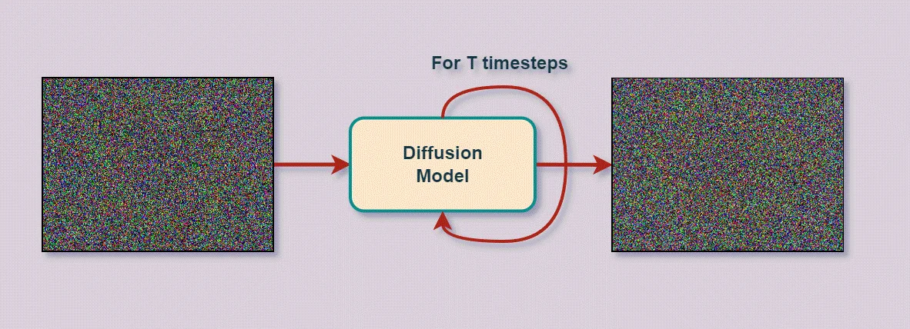
Source: [Stable Diffusion – A New Paradigm in Generative AI](https://learnopencv.com/stable-diffusion-generative-ai/)

A natural question might be, why should we bother with a noise level? Why do we need to do this over so many steps? The simple answer is that we make the problem relatively easier. We aren't asking the model to generate an amazing piece of art from completely random noise. We just ask it to remove some noise from a noisy image. This not only gives us more training data but it also improves training stability.
 

[[Back to top]](#)

### 2.1. Adding Control (Context)

We simply modify the U-Net so that it takes in token embeddings alongside the noise input and amount. This could be as simple as creating a context vector and just multiplying it with the result of the layers in the model. Or, as is the case with StableDiffusion, we could use something like attention layers between the CNN blocks of the U-Net.

While training, we also randomly mask some of the context to help the model better learn the general structure of images in the data.

During the image generation process, we can pass in custom context vectors to direct the model to generate something we want.

[[Back to top]](#)

### 2.1.1. Context Vector

The simplest way to add context is to just use a one hot encoded representation of the classes you have. However if you want to offer a lot more control, an embedding is the way to go. Traditionally a language model is used to acquire this embedding. The original diffusion paper used BERT while StableDiffusion uses CLIP. Research has shown that the quality of the LLM significantly affects the quality of the generated image. 

[[Back to top]](#)

### 2.1.2. [CLIP](https://arxiv.org/abs/2103.00020)

CLIP (Contrastive Language-Image Pre-training) contains both an image and text encoder. It takes as input an image and a caption, encodes them and compares the embeddings using a (cosine) similarity metric. The model is then trained on this similarity task (=1 when the image and caption are related and =0 otherwise). After training for a long while, our encoder reaches a point where the image embedding for a picture of a dog and the text embedding for "a picture of a dog" are very similar. To better train the model, negative samples are also used (sample an image and unrelated caption or vice-versa). We can then give it a phrase and acquire an embedding in the image space that corresponds to that phrase.

[[Back to top]](#)

### 2.2. Denoising Diffusion Implicit Models

One issue with DDPM is that the sampling process is slow since there are many timesteps and each timestep is dependent on the output of the previous timestep.

DDIM is faster because it skips a bunch of timesteps. Essentially this makes the model predict a rougher idea of what the final output would look like. The trade-off is of course that the results aren't as good as DDPM. 

Note: Regardless of how the model was trained, we can use either DDPM or DDIM since they are both just sampling methods. HuggingFace implements a wide variety of these sampling algorithms and more information can be found [here](https://huggingface.co/docs/diffusers/v0.3.0/en/api/schedulers#implemented-schedulers).

[[Back to top]](#)

## 2.3. [Textual Inversion](https://arxiv.org/abs/2208.01618)

Source: [Textual Inversion Paper](https://arxiv.org/abs/2208.01618)

Textual inversion is an interesting technique that arose as a way to achieve very fine-grained control of the generated image. In essence, it involves teaching the model to learn a new "word" in its embedding space. That is, we finetune the model on prompt+image combinations that use the new word. The prompts here are variations of the phrase "This is a picture of X" and the image is usually a noisy picture of the concept, which the model attempts to denoise. Then by using this new word in prompts, we can obtain very specific images that use the concept associated with this word. Note that the aim of this process it to just learn a new embedding for the target word. Thus all the other layers are frozen and even within the embedding layer, only the new embedding is trained. The gradients for all other tokens are zeroed out. 

Textual inversion can be used for a number of different applications.  The obvious one is of course text-guided generation of images but this technique can also be used for style transfer and even bias reduction! You can see this in action in the paper or in this [blog post](https://textual-inversion.github.io/).

## 2.4. [Latent Diffusion](https://arxiv.org/abs/2112.10752)

Source: [Latent Diffusion paper](https://arxiv.org/abs/2112.10752)

In latent diffusion, instead of working in the pixel space, we work in a latent space (via an autoencoder). This is helpful in speeding up the process. Instead of working on a gigantic 512x512 pixel space, we can compress that into a much smaller latent space and get very similar results.

This works exactly the same way as the diffusion process described above but with an additional step. In the forward diffusion step, the image is encoded into the latent space and the noise is also sampled from the latent space. In the image generation step, the generation process happens entirely in the latent space and there is a final step to decode it back into the RGB space.

This is the basis for most of the models we cover later in this document. The diagram above illustrates this process.

[[Back to top]](#)

## 3. [Stable Diffusion](https://stability.ai/stablediffusion)

Stable Diffusion is a latent diffusion model. It is perhaps the most popular image generation model today for a simple reason - it's fully open source. You can create, deploy and productize your own version of the model! There's plenty of models online for you to play around with and several communities focused on it. It's normally pretty good at most types of art and can be specialized to a particular art style by just finetuning an existing model (or training your own!). 

Due to its open source nature, there are several different versions of Stable Diffusion. These generally have the same architecture but tend to vary in terms of the data they were trained on. The model consists of three components:

1. Text Encoder:
    * Uses ClipText (GPT-Based)
    * Input: Text
    * Output: Embeddings for each individual token

2. Image Information Creator:
    * Uses U-Net + a scheduling/sampling algorithm (such as DDPM or DDIM)
    * Input: Token embeddings + Noise + Noise Amount
    * Output: "Information" array
    * This is where the reverse diffusion/image generation occurs over a number of steps.

3. Image Decoder:
    * Autoencoder decoder that creates an image from the information array
    * Input: Information array
    * Output: RGB Image

Customization: You can create images from prompts, you can perform inpainting, you can modify images, upscale, zoom out etc. You can pretty much do anything the other models can (or the open source community will get something setup for it if it doesn't exist already!). The latest Stable Diffusion XL model can generate 2048x2048 images too!

[[Back to top]](#)

## 3.1. [Stable Diffusion XL](https://arxiv.org/pdf/2307.01952.pdf)

Stable Diffusion XL 1.0, also called SDXL 1.0, is, at the time of writing, the latest version of Stable Diffusion. This makes a number of improvements on the existing Stable Diffusion architecture:

1. Architecture & Scale:

    As newer models are wont to do, SDXL also has a lot more parameters, running in at 3.5B parameters for the base model compared to the measly ~900M parameters of previous versions. This is the result of a number of changes such as replacing the lower level features of the U-Net with transformer blocks and using a more powerful text encoder (for conditioning) by combining two text encoders - OpenCLIP ViT-bigG and CLIP ViT-L (which together make up about 817M parameters). In addition they also introduce a "refiner model" (more on that in a minute) which uses a whopping 6.6B parameters.

2. Micro-Conditioning:

    **Conditioning the Model on Image Size:**

    An issue with previous versions was that a minimum image size (usually 512) had to be enforced thus forcing people to either discard (causing a loss in training data) or upscale smaller images (causing a loss in data quality). As a solution to this, they provide additional conditioning to the U-Net in the form of the original image's resolution. This solves the previous issue and also allows users to set a desired size during inference.

    **Conditioning the Model on Cropping Parameters:**

    Sometimes images are cropped to the lowest size image in the batch due to library requirements (For instance PyTorch requires tensors of the same size). This can result in generations having this cropped effect. As a solution to this, they provide additional conditioning to the U-Net in the form of two parameters signifying the amount of pixels cropped from the top left corner in both the vertical and horizontal axes. During inference, we can set these parameters to (0, 0) and thus resolve the issue of images looking like they were cropped.

3. Multi-Aspect Training:

    Many datasets used for this task tend to utilize square images of shape 512x512 or 1024x1024. The authors argue that this is unrealistic given the widespread use of landscape or portrait images. Thus they finetune the model to handle multiple aspect-ratios. They do this by partitioning their dataset into several buckets of different aspect ratios. While training, each batch uses images from the same bucket and the bucket used is alternated per step. The bucket size (height, width) is also sent to the model as conditioning. This step is done as fine-tuning after the pre-training process.

4. Improved Autoencoder:

    They use the same architecture as the original Stable Diffusion but use a much larger batch size and also track weights with an exponentially moving average.

5. Overall Training Process

    The base model is trained on images with a resolution of 256x256 while using size and crop-conditioning. Then, the model is trained on 512x512 images and finally multi-aspect training is done with different aspect ratios.

6. Refinement Stage:

    The authors found that the resulting model from the above steps sometimes resulted in poor quality generations. As a solution to this, they trained a separate latent diffusion model in the same latent space which focused on high-quality, high resolution data. This is done via a technique called [SDEdit](https://arxiv.org/abs/2108.01073) (which we aren't going into here). During inference, they use the base model for the initial steps but use this refinement model for the later steps. That is, the refiner can be plugged in before we decode the generated image from the latent space to pixel space. While they note that the use of the refiner is optional, they found that the quality of images were significantly improved, especially for detailed background and human faces.

[[Back to top]](#)

## 4. [Midjourney](https://www.midjourney.com/)

Midjourney is another popular image generation model favored by the community. However Midjourney is closed source, meaning we don't know the exact architecture and we can't finetune it for our own purposes. Though there are some [hints](https://twitter.com/EMostaque/status/1561917541743841280) that it runs on a variant of Stable Diffusion. Midjourney excels at more "aesthetically pleasing" generations compared to Stable Diffusion and DALL-E. However this sometimes results in the model ignoring parts of your prompt to make things look pretty.

At present, Midjourney is only available through their [Discord](https://discord.com/invite/midjourney) server. Midjourney no longer offers a free tier so you will have to subscribe to one of their plans to use it. Note that unless you use their highest tier, all your images will be publicly visible. Subscribers to their Pro Plan, can use a "stealth" mode.

Customization: You can create images from prompts but you can also modify images by uploading your own. You can also upscale the generated images or make variations of a generated/uploaded image. They also have a "zoom out" feature that lets you extend the boundaries of an image.

[[Back to top]](#)

## 5. [DALL-E](https://openai.com/dall-e-2)

DALL-E is OpenAI's (of ChatGPT fame) solution to the text-to-image problem. We're specifically 
gonna be talking about DALL-E 2 (the original DALL-E used a dVAE based architecture, not a diffusion model). The underlying model used by DALL-E is [GLIDE](https://arxiv.org/abs/2112.10741?) which is a type of diffusion model. 

Getting images from DALL-E is as simple as making calls to OpenAI's [API](https://platform.openai.com/docs/guides/images/image-generation-beta). Their documentation explains how to use the API relatively well.

Customization: You can create images from prompts, you can mask out parts of an image and ask it to inpaint it and you can ask for variations of a given image. You can also choose between generating 256x256, 512x512 and 1024x1024 images.

[[Back to top]](#)

## 6. [Imagen](https://arxiv.org/abs/2205.11487)

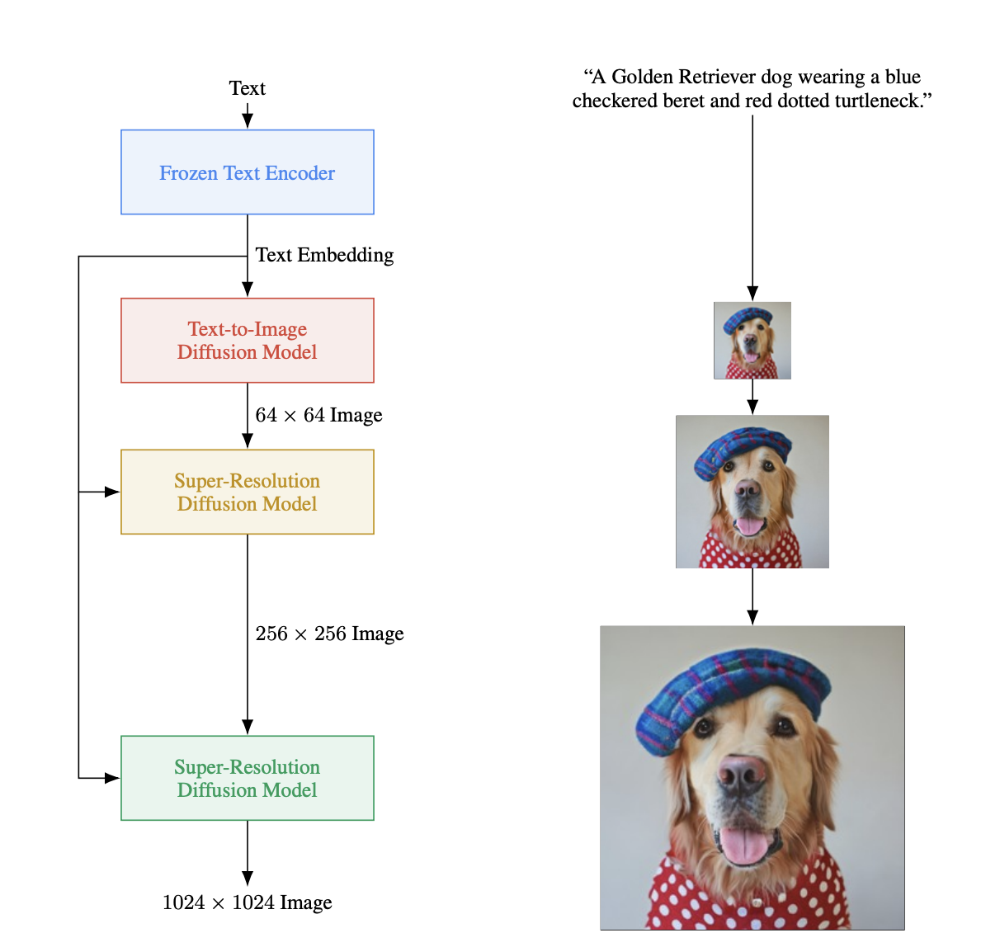
Source: [Imagen paper](https://arxiv.org/abs/2205.11487)

Imagen is a text-to-image diffusion model developed by Google. They use pre-trained large language models to encode text for image synthesis and found that scaling the size of the LLM resulted in better performance versus just scaling the size of the image diffusion model. In addition, they modify the U-Net architecture to introduce the Efficient U-Net. They state that it converges faster and is more memory efficient than the U-Net. Further, they used cascading diffusion models since [previous research](https://cascaded-diffusion.github.io/) found that they are very effective in progressively generating high quality images. They also make several other modifications such as a new benchmark and dynamic thresholding but we'll direct you to the paper linked above for those!

The model is trained on an internal dataset of about 460M image-text pairs along with the publicly available LAION dataset with about 400M pairs.

Thus the Imagen model pipeline consists of:
* Frozen LLM: Encodes text for conditioning. They found that T5-XXL (11B parameters) worked very well for them.
* Diffusion Model: Generates a 64x64 image. This is similar to the U-Nets used by the other models above. In total, it came to about 2B parameters.
* Super-Resolution Diffusion model: Upsamples to 256x256 resolution. This uses their newly introduced Efficient U-Net and has 600M parameters.
* Super-Resolution model: Upsamples to 1024x1024 resolution. This uses the same model as above but removes some components such as self-attention layers. This has 400M parameters.

[[Back to top]](#)

## 7. Comparison

In short, if you just want to use something quickly without much hassle and don't mind paying a fee to do so, DALL-E is the easiest to use. If you want full control over the data your model uses as well as the training process itself, Stable Diffusion is your best bet. It's also a good choice if you want to keep things completely offline. If you have a scenario where the appearance of the image is more important than the (relative) accuracy, Midjourney is a good choice.

There are also other options such as Google's [Imagen](https://imagen.research.google/) which we haven't included here since they are not publicly accessible at the time of writing.

To help understand how these models work a little better, here are some sample generations along with the prompts used. If there are multiple images generated, we picked the subjective best one. Images were generated on:
* July 13th 2023 with [Dall-E 2]((https://labs.openai.com/))
* August 2nd 2023 with [Stable Diffusion XL 1.0](https://clipdrop.co/stable-diffusion). 
* July 27th 2023 with Midjourney v5.2.

| Prompt | DALL-E 2 | Stable Diffusion | Midjourney |
|--------|----------|------------------|------------|
| An apartment building designed like a fridge.             | 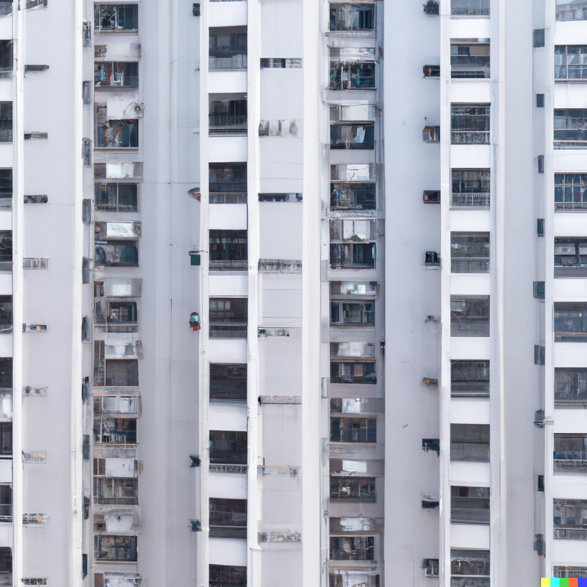  | 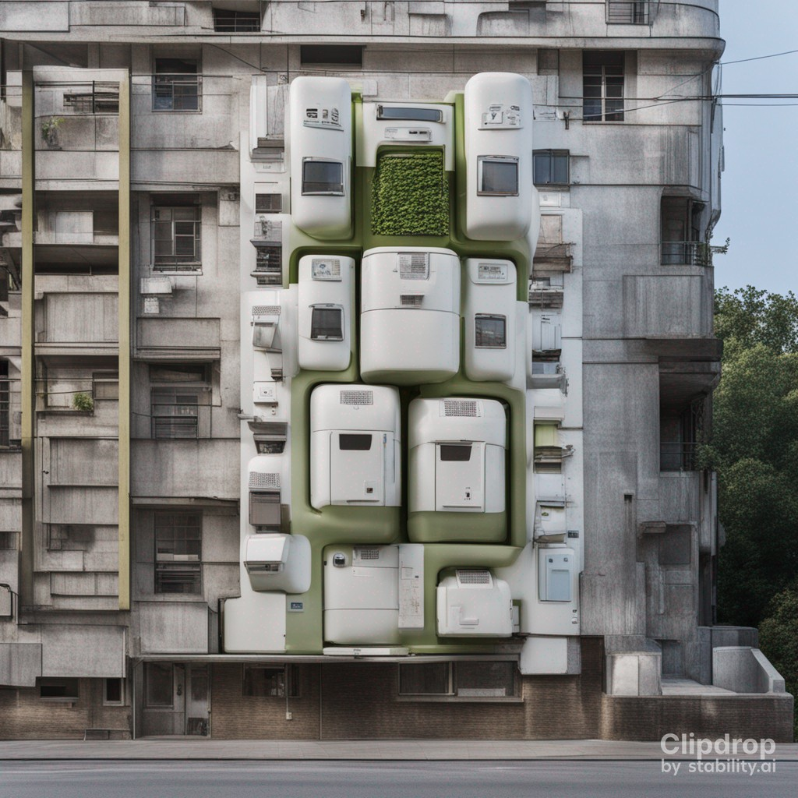 | 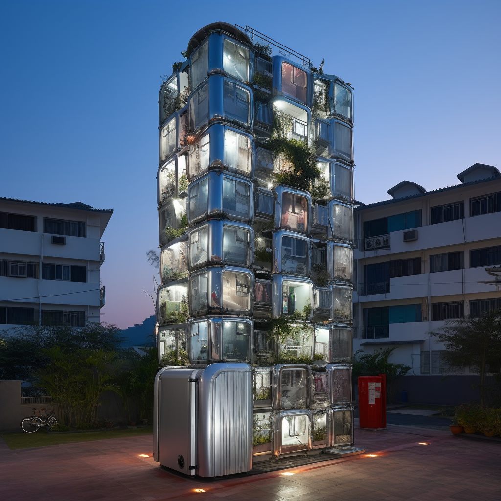 |
| A margherita pizza in a restaurant overlooking the sea.   | 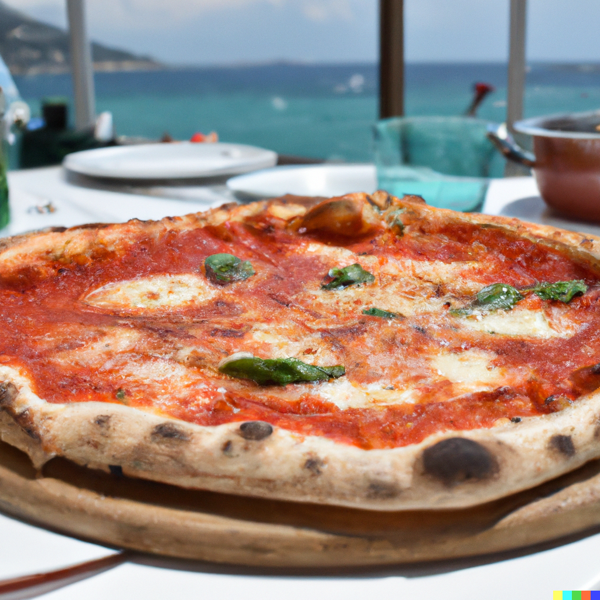   | 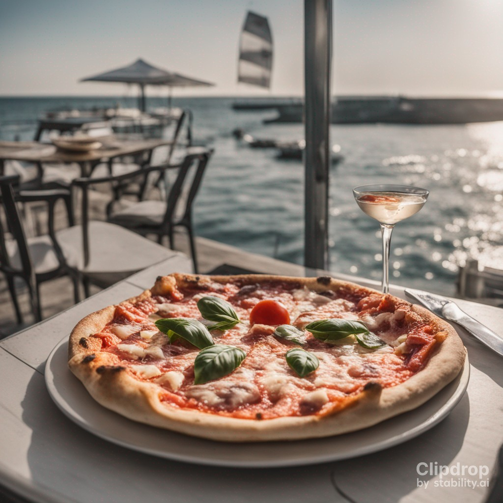 | 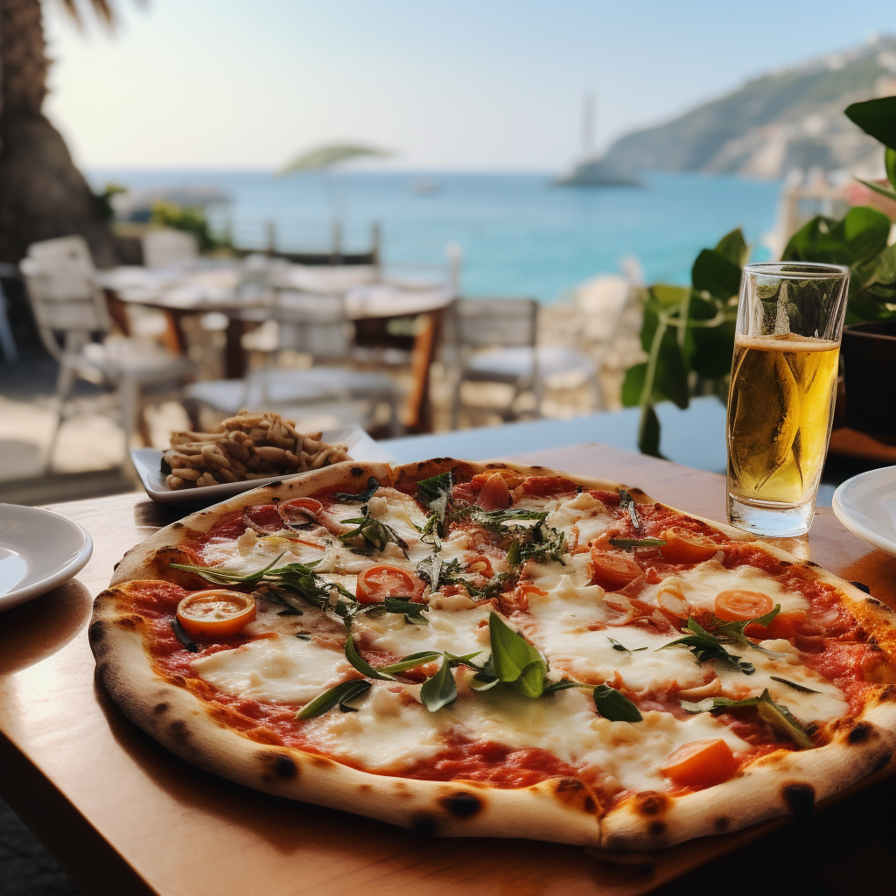 |
| A man in a suit and top hat walking down a dark alleyway. | 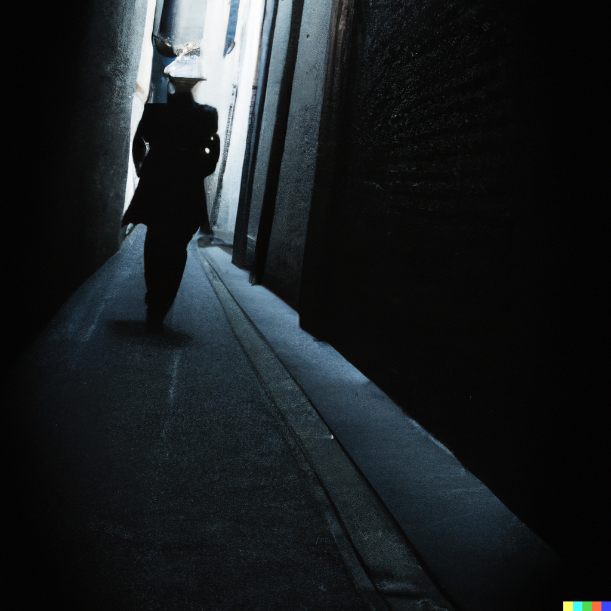   | 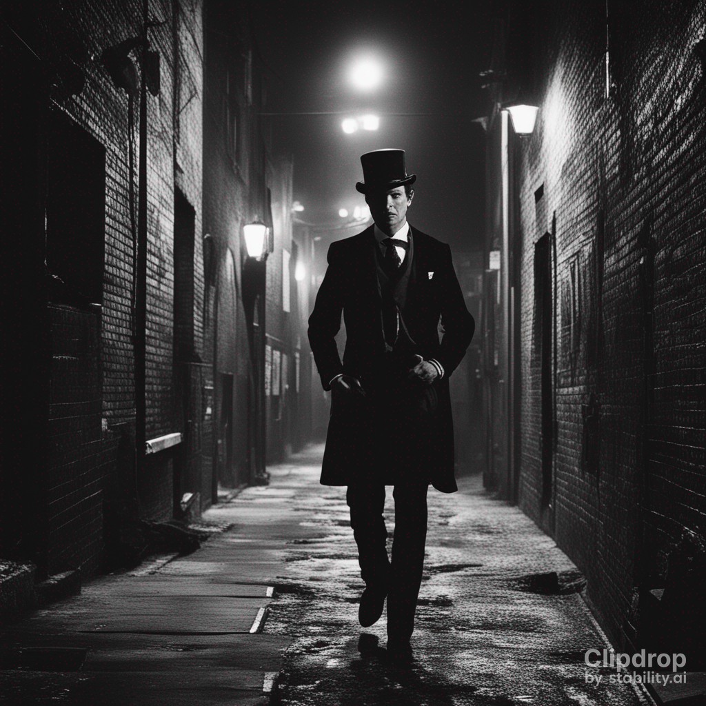 | 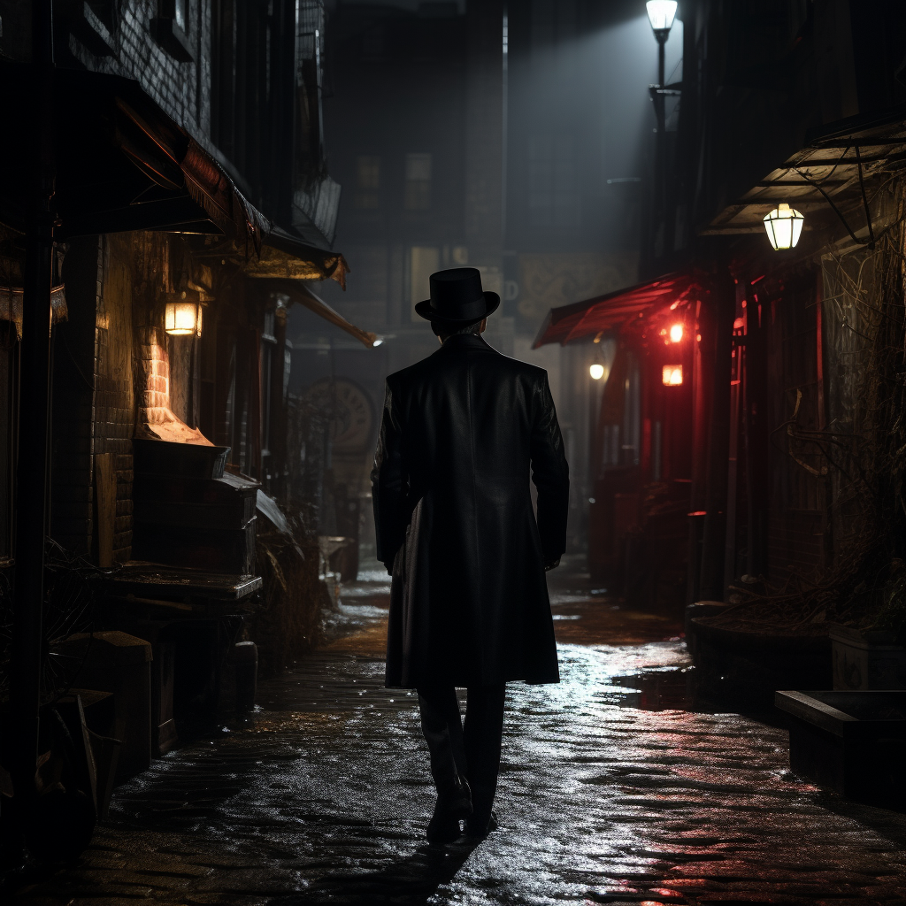 |

We leave these images with an obligatory disclaimer - none of these prompts were tuned. You are likely to get far better results after tuning these prompts per model. We link to a guide to this in the resources section below.

[[Back to top]](#)

## 8. Getting Started

* For StableDiffusion, we have an example notebook setup for you at `examples/text_to_image_stable_diffusion.ipynb` (we've tested this on Colab free, you just need to use a T4 GPU!). If you don't want to go through code at the moment, you could just play around with [StabilityAI's Stable Diffusion XL](https://clipdrop.co/stable-diffusion).

* Midjourney is currently available only through their [Discord](https://discord.com/invite/midjourney) server, so we recommend you try it out there instead. Note that there is no longer a free tier for this service.

* For OpenAI, we have an example notebook setup for you at `examples/text_to_image_dalle.ipynb` (you can run this locally). Note that you will need to provide an OpenAI key and you will be charged for using it (approx $0.016 / 256x256 image). If you just want to play around with the model, we suggest using the [website](https://labs.openai.com/) which offers limited free credits to generate images with.

[[Back to top]](#)

## 9. Resources

* [The Illustrated Stable Diffusion](http://jalammar.github.io/illustrated-stable-diffusion/): A blog post by the excellent Jay Alammar

* [Awesome Generative AI](https://github.com/filipecalegario/awesome-generative-ai): A collection of GenAI resources (including text, audio and video!)

* [The Ultimate Prompting Guide](https://prompthero.com/stable-diffusion-prompt-guide): An informative and easy to follow guide on how to get the most out of text-to-image models.

[[Back to top]](#)