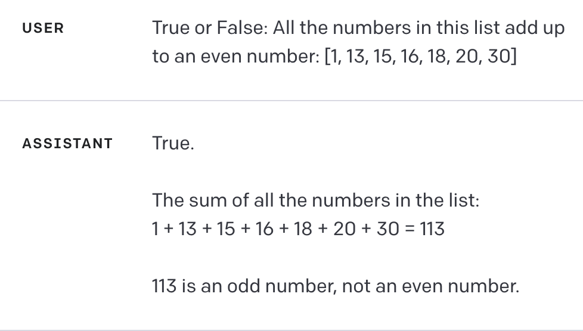
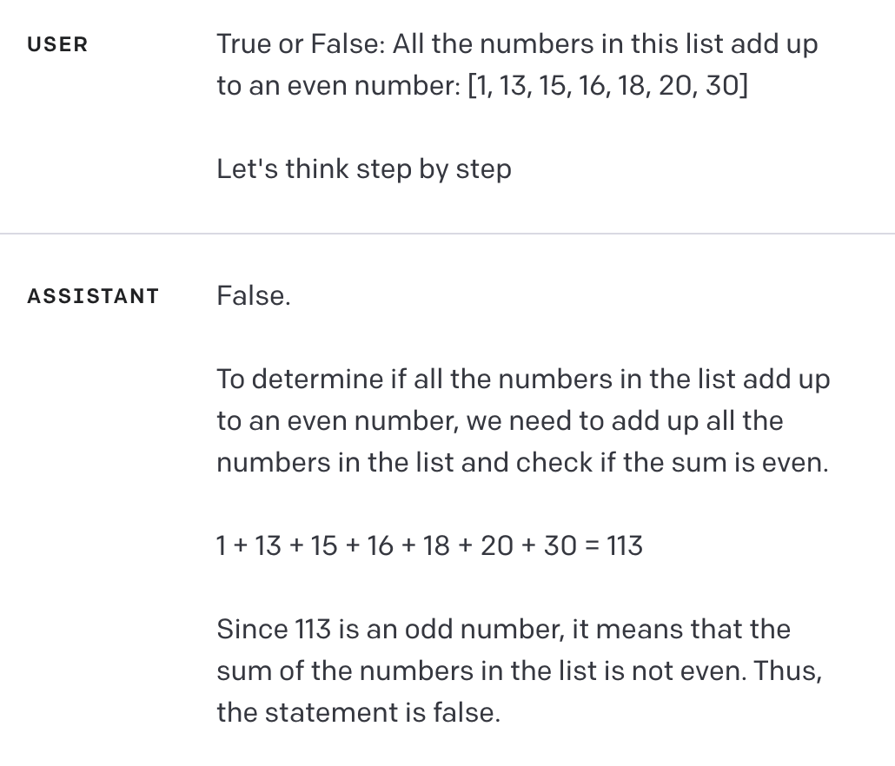
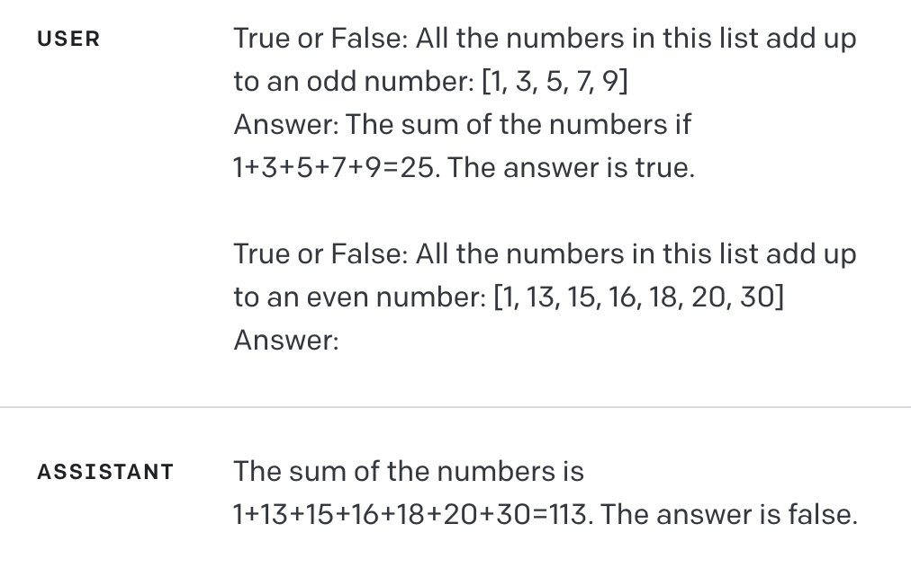
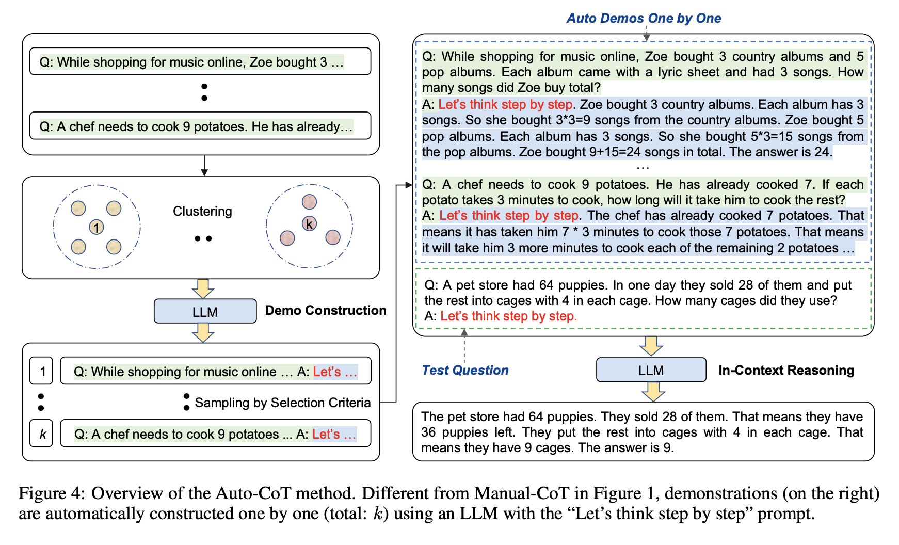
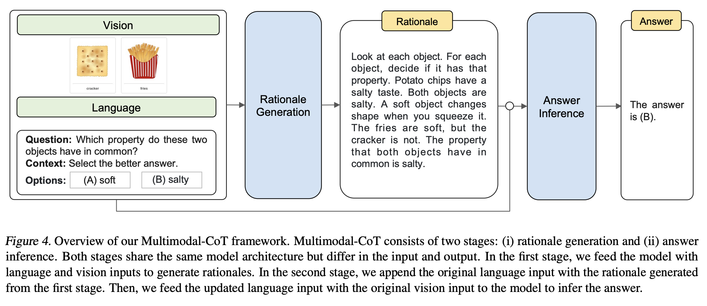
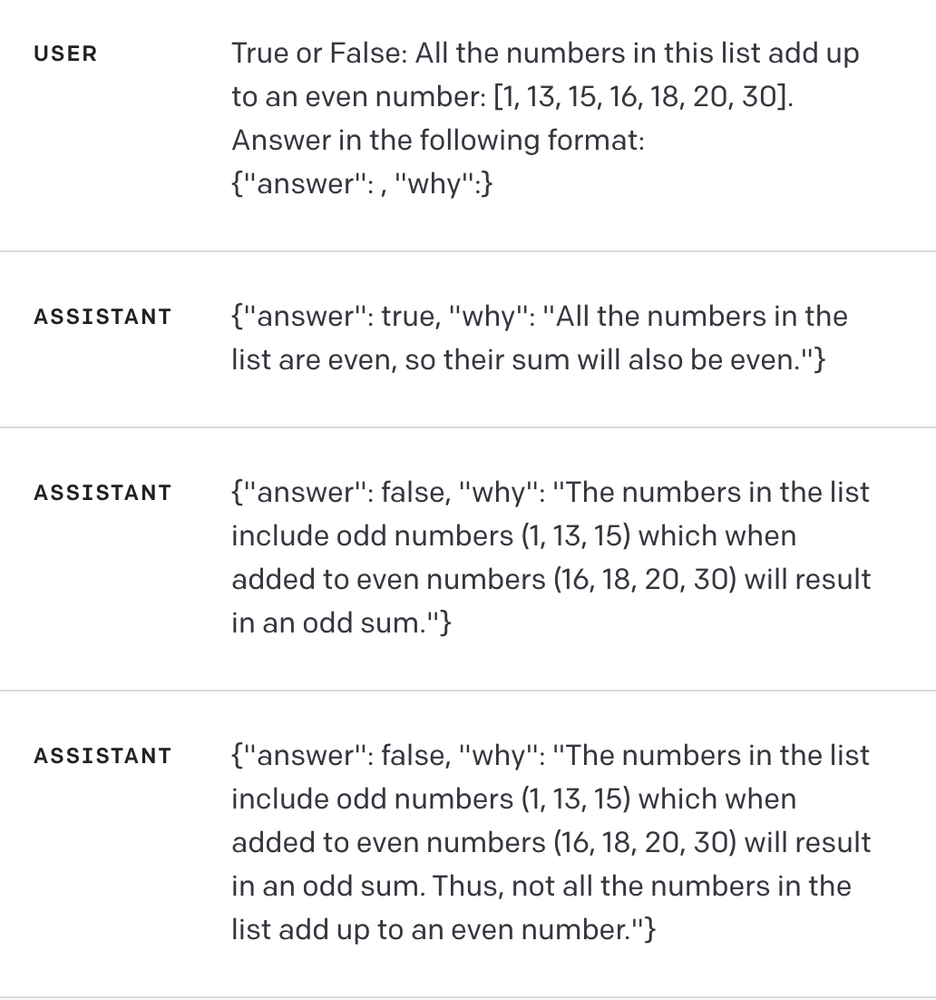
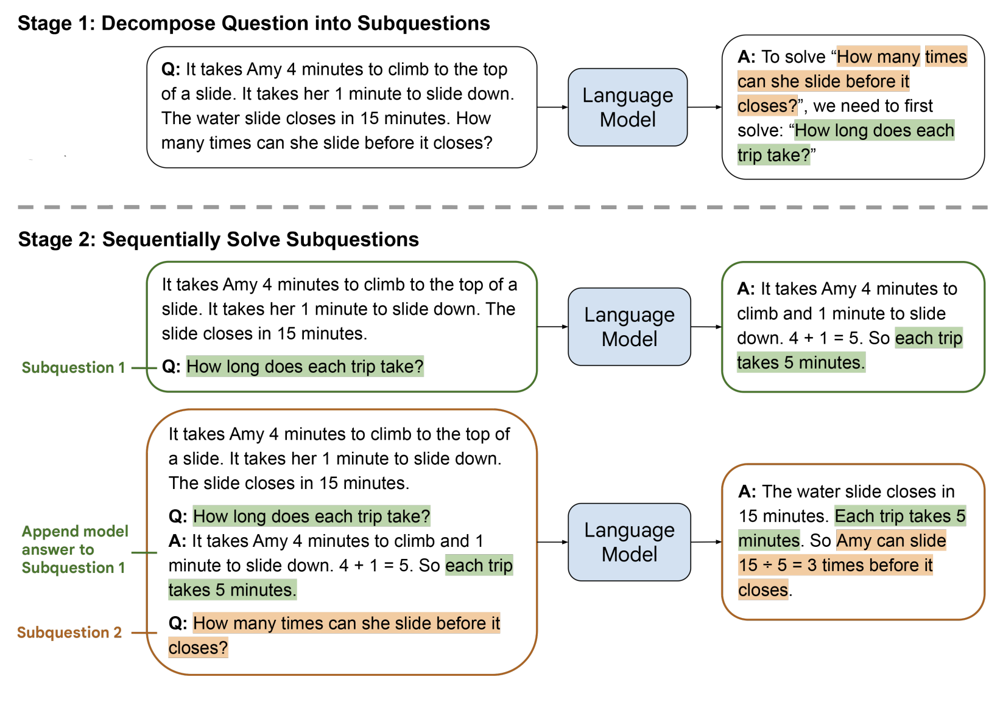
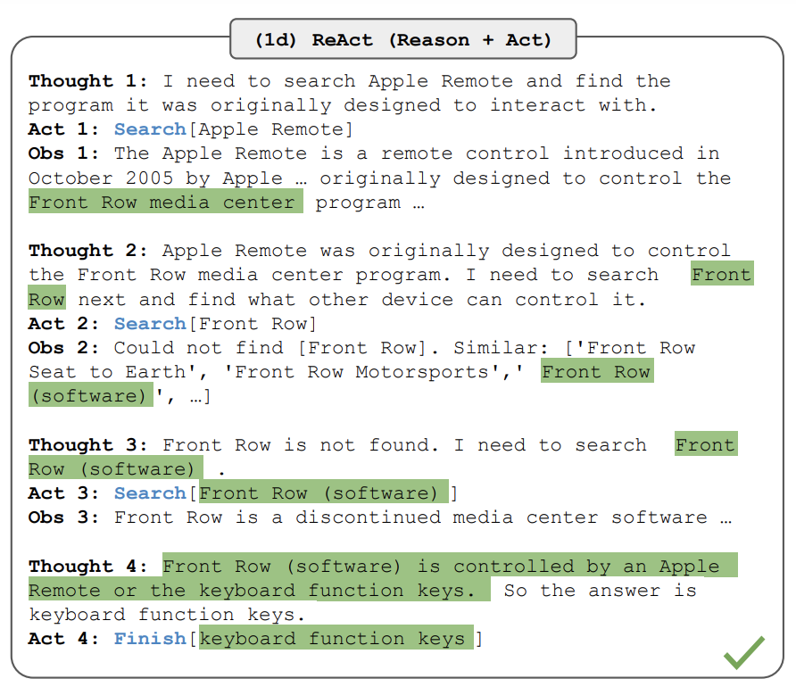
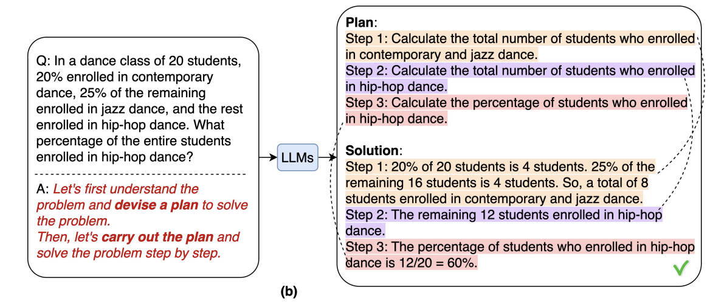

# Reasoning

## Table of Contents
- [Reasoning](#reasoning)
  - [Table of Contents](#table-of-contents)
- [Introduction](#introduction)
- [Chain-of-Thought (CoT)](#chain-of-thought-cot)
  - [Zero-Shot CoT](#zero-shot-cot)
  - [Few-Shot CoT](#few-shot-cot)
  - [Automatic Chain-of-Thought (Auto-CoT)](#automatic-chain-of-thought-auto-cot)
  - [Multimodal Chain-of-Thought](#multimodal-chain-of-thought)
- [Self-Consistency](#self-consistency)
- [Knowledge Generation](#knowledge-generation)
- [Least-to-Most Prompting](#least-to-most-prompting)
- [Agents](#agents)
  - [Tool Use](#tool-use)
  - [ReAct](#react)
  - [Plan-and-Solve](#plan-and-solve)
- [Resources](#resources)
  - [References](#references)

# Introduction

LLMs are useful for a variety of tasks. Sometimes though, they need a little nudging in the right direction. Broadly speaking, reasoning refers to a collection of techniques that can perform this nudge. In essence, we want to make the model "think" through things, break a task down into individual steps or explain its own reasoning.

Note: When we say reason or think in this context, we are not referring to the kind of thinking or reasoning that we, as humans, are capable of. This [blog](https://cacm.acm.org/blogs/blog-cacm/276268-can-llms-really-reason-and-plan/fulltext) encapsulates the difference between these two ideas.

# Chain-of-Thought (CoT)

Chain-of-Thought is the most popular approach to making a model think. The idea is to make the model think of the intermediate steps between the input and the output. Consider the following scenario where we ask the model a question:



We can see that the model contradicts itself by giving the wrong answer but a correct explanation.

Note: This and all other examples were created using the [OpenAI playground](https://platform.openai.com/playground). We used `gpt-3.5-turbo` (as of September 5th 2023) with default parameters. These examples are illustrative and may no longer work on updated versions of the model.

## Zero-Shot CoT

The simplest way to perform CoT is by appending the phrase "Let's think step by step" to the prompt. Taking the same example as above:



We see that the model explains its reasoning and then provides the correct answer. This method is known as zero-shot CoT because we do not give the model any prior examples to learn from. That is, the model has had zero shots at this question before. We use the phrase "Let's think step by step" over other similar sounding phrases for a rather simple reason - [research](https://arxiv.org/abs/2205.11916) has shown that it works best. 

## Few-Shot CoT

In some cases, we might not be as successful with zero-shot CoT. This could be due to it being a complex task or having some other flaw that could be rectified if only the model had some examples to work with. That's precisely what few-shot CoT attempts to do. Specifically, we provide the model with one or more examples that illustrate how to perform the task. Like so:



Here we provided a single example on how to handle a similar task. The model learns from this example while attempting to answer our actual question.

## [Automatic Chain-of-Thought (Auto-CoT)](https://arxiv.org/abs/2210.03493)

Few-Shot CoT requires manual effort in finding or crafting examples. Auto-CoT is an approach that eliminates this manual effort by leveraging zero-shot CoT. More specifically, it uses two technqiues - question clustering and demonstration sampling. First, it partitions questions in a dataset into a few clusters. Following this, demonstration sampling is performed. In this process a representative question is picked from each cluster. Questions within each cluster are sorted by their closeness to the cluster center. Zero-shot CoT is used to generate answers to questions, with the first question-answer pair that meets some criteria (such as total length or number of reasoning steps) being selected as the representative of that cluster.



Source: [Automatic Chain of Thought Prompting in Large Language Models](https://arxiv.org/abs/2210.03493)

## [Multimodal Chain-of-Thought](https://arxiv.org/abs/2302.00923)

CoT usually focuses only on text but can also be extended towards a multimodal combination of images and text. The idea is to fuse the image embeddings (obtained through a vision transformer) with the text embeddings and then decode the resulting output. Multimodal CoT happens over two steps. In the first step, the text and image input embeddings are fused and then passed to the LLM to generate a rationale. Then, this rationale is appended to the original text input. This new text input and the original image information are once again fused and passed to the LLM to generate the final answer. 

The example below demonstrates this in action. However, it is important to remember that the performance of a such a system is also reliant on using a good vision model. In addition, fine-tuning might also be required to align the vision embeddings with the text embeddings.



Source: [Multimodal Chain-of-Thought Reasoning in Language Models](https://arxiv.org/abs/2302.00923)

# [Self-Consistency](https://arxiv.org/abs/2203.11171)

In some scenarios we may observe that the LLM doesn't always return the same answer to a given question. In other scenarios, it may even hallucinate things. One solution to this problem is to enforce consistency on the output of the LLM. Or rather, we generate multiple answers and take the most consistent answer. In the simplest case, we get some N answers and just take the majority vote to be our final answer. Of course, this is only doable in scenarios where we expect some kind of structured output so that we know the location of the answer.

Self-consistency is a good tool to use for a number of reasons. Firstly, it's completely unsupervised with no need for human intervention. Second, it requires no additional training, prompting or fine-tuning. We only run the same query multiple times and then take the majority vote. From a more traditional machine learning perspective, this can be thought of as a self-ensemble of models I.E., an ensemble of models where we use the same model each time.

Consider the following example:



Here we see that the first model output is flat out wrong. However, if we take the majority vote here, the correct outcome wins out. 

In scenarios where we may not have a structured output or otherwise have an answer that isn't easily extractable, self-consistency doesn't work. In these scenarios, one alternative is to use another, more powerful LLM to act as a judge of the outputs. As an example, we could use GPT-3.5 to generate 10 answers and then prompt GPT-4 to judge the best answer.

One caveat with self-consistency is that it is an expensive process. Instead of just making a single call for a prompt, we end up having to make a lot more. This adds up over time, especially when we scale things up. Hence, it may not always be the best choice to use self-consistency. As an alternative many LLMs become effectively deterministic when the temperature is set to 0 (with the exception of GPT-4). This does, however, come at a cost of reduced creativity from the LLM - which may or may not be useful depending on the scenario.

# Knowledge Generation

There are many scenarios where we might want the LLM to reference some knowledge while generating text. Usually, this involves the use of external knowledge sources such as private documents or just something like Wikipedia. We cover this topic in the `information_retrieval.md` document. On the other hand, we might want to rely on knowledge that the model itself produces. In such cases, we simply ask the model to generate the knowledge for us. While it poses a greater risk of hallucination, it also does help guide the model in terms of the answer it generates. 

For instance:


Note: the defualt maximum length was 256 tokens which is why the second paragraph cuts off.

An alternate approach would be to split up the prompt to ask for facts separately and then pass the facts as part of the second prompt. In this scenario we would not have the issue from above where we hit the token limit due to the generation of facts.

# [Least-to-Most Prompting](https://arxiv.org/abs/2205.10625)

Least-to-Most prompting is a way to get the model to break down tasks into a set of subtasks. Then each subtask is solved in order with the prompt and solution for the previous subtask being fed into the model at each step. In essence, we want to solve the smallest individual problem and slowly build our way to the final answer. The example below demonstrates this two step process.



Source: [Least-to-Most Prompting Enables Complex Reasoning in Large Language Models](https://arxiv.org/abs/2205.10625)

Least-to-Most prompting works relatively well but does run into problems with context size due to the addition of each subtask to the prompt. This is especially true when the initial prompt is large or if there are a lot of subtasks. One alternative to this method is to use agents, that is, LLMs that can make use of reasoning and tools. 

# Agents

So far we have seen different methods of making an LLM "think" or "reason".
An agent is simply an LLM that has access to a collection of tools (called a toolkit).

## Tool Use

For some tasks, we may not need to use an LLM. For instance, we already know how to do math. We don't need to ask the LLM to sum the rows of a spreadsheet. Instead, we might want to use the spreadsheet's existing summation capabilities. In other cases, we might not be able to complete a task with just an LLM. For instance, if we wanted to find and summarize news articles on some recent even, we would need to provide the LLM with the capability to search. 

Tools can thus be thought of as augments to enhance an LLM's capabilities. There are tools to search Google, perform complex math, interface with APIs, interact with databases and more. In order to use these tools, we provide a text description of the available tools in our initial prompt alongside the function definition. The LLM can then "call" the tool (usually handled by libraries like Langchain) with the correct parameters to obtain the result of that function.

So far we have seen ways to make the LLM reason. Tools are extremely powerful in that they enable the LLM to act on their thoughts. This combination of reasoning and tools is the foundation for agent frameworks like ReAct and Plan-and-Solve. 

## [ReAct](https://arxiv.org/abs/2210.03629)

ReAct or "Reasoning and Acting" is a framework through which we make an LLM reason about the task and then perform actions based on it. This allows the model to not only create plans of action but also track and update their status. Here, reasoning refers to the various thought methods we discussed above such as CoT while acting refers to the actions an agent takes based on the reasoning step. This usually includes the use of tools. 

Consider the following prompt:
```
Question: Aside from the Apple Remote, what other device can control the program the Apple Remote was originally designed to interact with?
```

This is a complex prompt which does not have an obvious answer. The LLM might not even have knowledge about the program or the device in question and instead just give an answer like "iPhone". Thus this cannot be solved using just reasoning. On the other hand, acting alone might not ask the right questions. Instead, we do a combination of both in the example below:



Source: [ReAct: Synergizing Reasoning and Acting in Language Models](https://arxiv.org/abs/2210.03629)

## [Plan-and-Solve](https://arxiv.org/abs/2305.04091)

Plan-and-Solve (sometimes referred to as plan-and-execute) prompting is a framework through which we make an LLM plan out the subtasks required to complete a task, and then carry out the subtasks according to the plan. In this framework there are actually two entities, a planner and a solver. The planner is usually an LLM while the solver is another LLM (usually just the same LLM but treated independently). In essence, the planner breaks down the task while the solver completes each subtask. The primary advantage of this strategy is that it keeps the planning and execution prompts separate, thus allowing the LLM to focus on a single problem at a time.

The planner LLM is usually just prompted to break down a task into subtasks similar to Least-to-Most prompting while the solver LLM uses a framework like ReAct to determine how to complete a subtask.



Source: [Plan-and-Solve Prompting: Improving Zero-Shot Chain-of-Thought Reasoning by Large Language Models](https://arxiv.org/abs/2305.04091)

# Resources

* [LangChain: Documentation](https://python.langchain.com/docs/get_started/introduction.html)
* [ACM: Can LLMs Really Reason and Plan?](https://cacm.acm.org/blogs/blog-cacm/276268-can-llms-really-reason-and-plan/fulltext)

## References

The following is a list of papers that cover the majority of the techniques we've discussed in this document.

* [Large Language Models are Zero-Shot Reasoners](https://arxiv.org/abs/2205.11916)
* [Automatic Chain of Thought Prompting in Large Language Models](https://arxiv.org/abs/2210.03493)
* [Multimodal Chain-of-Thought Reasoning in Language Models](https://arxiv.org/abs/2302.00923)
* [Self-Consistency Improves Chain of Thought Reasoning in Language Models](https://arxiv.org/abs/2203.11171)
* [ReAct: Synergizing Reasoning and Acting in Language Models](https://arxiv.org/abs/2210.03629)
* [Least-to-Most Prompting Enables Complex Reasoning in Large Language Models](https://arxiv.org/abs/2205.10625)
* [Plan-and-Solve Prompting: Improving Zero-Shot Chain-of-Thought Reasoning by Large Language Models](https://arxiv.org/abs/2305.04091)